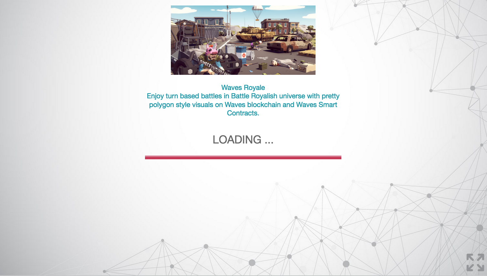
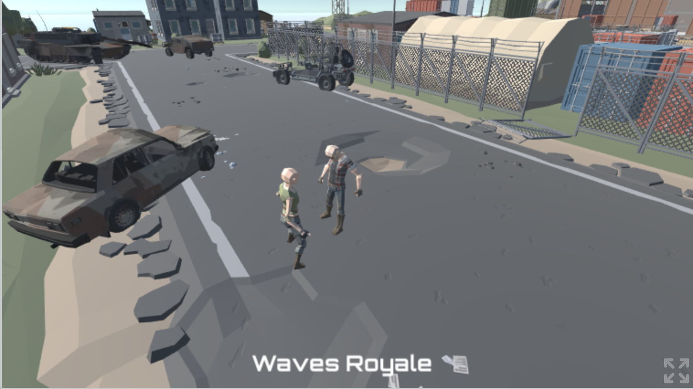

# Описание игры

Игра сделана по принципу камень-ножницы-бумага.

Процесс и основные стадии:

1. Первый Игрок создает игру (initGame)
2. Первый Игрок запускает регистрацию (startRegistration)
3. Регистрируется сам (registerPlayerOne)
4. Первый игрок приглашает в игру второго - отправляет второму игроку функцию для регистрации (registerPlayerTwo) и тот ее должен запустить, и подписать json транзакции, который она возвращает, своим ключом.
5. Первый игрок смотрит блокчейн и если видит, что второй игрок уже зарегился, начинает игру (beginGame). Либо если второй игрок долго не регистрируется, то вызывает функцию initGame, чтобы начать игру заново и пригласить другого игрока.
6. Ходит первый игрок (playerOneMove). В параметры функции передает число 0 (камень), 1 (ножницы), 2 (бумага). Говорит, второму игроку, что сходил
7. Ходит второй игрок (playerTwoMove).
8. Как только в блокчейне появляется данные о ходе второго игрока, то первый игрок запускает функцию endGame.
9. В зависимости от результата, игроки забирают награду.

В контракте предусмотрено, чтобы каждый шаг мог быть выполнен только после завершения предыдущего.
Каждый шаг представлен отдельным состоянием контракта. Команда на переход в следующее состояние представляется дата-транзакцией в блокчейн (src/txdata.js). Контракт отслеживает валидность перехода, если все ок, то транзакция проходит, если нет - отклоняется.

Для запуска игры:
```
git clone
yarn
yarn start
```

Контракт игры здесь: waves/contract.script,

[Адрес смарт-аккаунта игры в testnet]: https://testnet.wavesexplorer.com/address/3MwpUQwpSfHV1rFfHqCuuYL7A9K8ursTQWk)

Текущий смарт-аккаунт игры и тестовые адреса игроков: src/accounts.js

# Скриншоты


